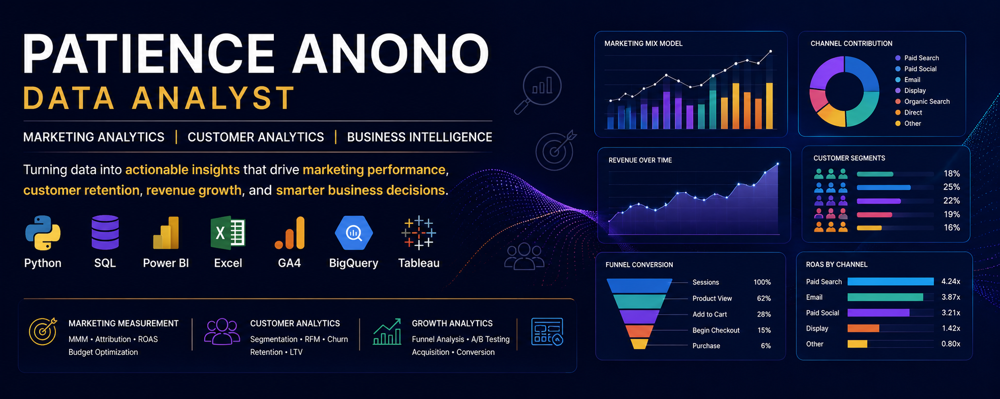

  

# 👋 Hi, I'm Patience Anono

### Marketing Data Analyst | Marketing Science | Growth & Customer Analytics

I help businesses turn marketing, customer and revenue data into insights that improve **marketing effectiveness, customer retention, revenue growth and business performance**.

My work sits at the intersection of **marketing analytics, statistical modeling, customer analytics and business intelligence**.

I use **Python, SQL, Power BI, Excel, BigQuery, GA4 and statistical modeling** to answer questions such as:

- Which marketing channels are actually driving incremental revenue?
- How should marketing budgets be allocated?
- Where are customers dropping out of the funnel?
- Which customers are most likely to churn?
- Which customer segments are most valuable?
- Which campaigns and experiments are producing better results?
- Where is revenue at risk?
- What should the business do next?

**Business Problem → Data → Analysis → Insight → Recommendation → Business Impact**

🌐 **[Portfolio Website](https://www.padataanalytics.com/)**  
💼 **[LinkedIn](https://linkedin.com/in/patience-anono-22ab06176/)**  
📧 **[Email](mailto:patienceanonowebbo@gmail.com)**

---

# 🚀 About Me

I am a **Marketing & Data Analytics Consultant at PA Data Analytics**, working across marketing measurement, customer analytics, revenue intelligence and business performance.

My strongest areas include:

- Marketing Mix Modeling (MMM)
- Multi-Touch Attribution
- Marketing Performance Analytics
- Marketing ROI & ROAS
- Customer Segmentation
- Churn & Retention Analytics
- Marketing Funnel Analysis
- A/B Testing & Experimentation
- SaaS Revenue Analytics
- E-commerce Analytics
- Business Intelligence
- Executive Dashboards & KPI Reporting

I enjoy going beyond reporting **what happened** to understand **why it happened and what the business should do next**.

---

# 📊 Core Analytics Areas

## 🎯 Marketing & Growth Analytics

- Marketing Mix Modeling
- Multi-Touch Attribution
- Campaign Performance
- Paid Advertising Analytics
- ROAS & ROI Analysis
- Budget Allocation
- Customer Acquisition
- Marketing Funnel Analysis
- Conversion Rate Analysis
- A/B Testing
- Customer Journey Analysis

## 👥 Customer Analytics

- Customer Segmentation
- RFM Analysis
- K-Means Clustering
- Churn Prediction
- Retention Analysis
- Cohort Analysis
- Customer Lifetime Value
- Customer Behavior Analysis
- Customer Health Scoring

## 💰 Revenue & SaaS Analytics

- MRR & ARR Analysis
- Revenue Growth
- Revenue Concentration
- Revenue at Risk
- Customer Retention
- Churn & Downgrade Analysis
- Product Engagement
- SaaS Revenue Health

## 📈 Business Intelligence

- Executive Dashboards
- KPI Reporting
- Performance Monitoring
- Commercial Analytics
- Operational Reporting
- Power BI Dashboards
- Excel Dashboards
- Data Storytelling

---

# 🛠️ Technical Skills

### Programming & Data Analysis

- Python
- Pandas
- NumPy
- Scikit-learn
- Statsmodels
- XGBoost
- SciPy
- Jupyter Notebook

### SQL & Data Warehousing

- SQL
- MySQL
- Google BigQuery
- Data Cleaning
- Data Transformation
- Aggregations
- Exploratory Data Analysis

### Business Intelligence & Visualization

- Power BI
- DAX
- Power Query
- Tableau
- Excel
- Pivot Tables
- Looker Studio
- KPI Design
- Dashboard Development

### Marketing Analytics Platforms

- Google Analytics 4
- Google BigQuery
- Google Tag Manager
- Google Ads
- Meta Ads
- Digital Advertising Analytics

---

# ⭐ Featured Marketing Analytics Projects

## 1. 🎯 Marketing Mix Modeling — Multi-Channel Budget Optimization

**Python | Statsmodels | OLS Regression | Adstock | Power BI**

Built an OLS-based Marketing Mix Model to evaluate how marketing investment contributed to revenue across multiple channels.

### Analysis

- Modeled 52 weeks of marketing and revenue data
- Applied adstock/carryover transformations
- Decomposed revenue into base demand and channel contribution
- Evaluated channel-level efficiency
- Built budget reallocation scenarios

### Key Result

**$722K revenue analyzed**

The model identified a potential **$58K incremental revenue opportunity** through modeled budget reallocation at equivalent total spend.

### Business Question

> How should the marketing budget be allocated to maximize revenue?

🔗 **[View MMM Project](https://github.com/PatienceAnono/Marketing-Mix-Modelling-ROI-Analysis)**

---

# 2. 🎯 Multi-Touch Attribution & Budget Optimization

**Python | SQL | Excel | Power BI | Marketing Attribution**

Built and compared five attribution methodologies across customer journeys:

- Last Click
- First Click
- Linear
- Time Decay
- Shapley / Data-Driven Attribution

### Dataset

- **11,292 touchpoints**
- **3,500 customers**
- **7 marketing channels**

### Key Finding

Different attribution methodologies produced substantially different views of channel performance and therefore different implied marketing budget allocations.

A Shapley-based allocation produced projected revenue of approximately:

**$203,603 per campaign**

compared with:

**$110,587 under Last Click**

A directional annualized difference of approximately:

**$4.84M**

under the project's assumptions.

### Business Question

> Are we giving marketing credit — and therefore budget — to the channels that actually contribute to revenue?

🔗 **[View Attribution Project](https://github.com/PatienceAnono/multi-touch-attribution-budget-optimisation)**

---

# 3. 📣 E-Commerce Advertising Performance Analysis

**Python | Excel | Power BI | Paid Media Analytics**

Analyzed digital advertising performance across campaigns and channels to identify inefficient spend and opportunities to improve marketing efficiency.

### Metrics Analyzed

- Impressions
- Clicks
- Ad Spend
- Revenue
- CTR
- CPC
- Conversions
- ROAS
- Campaign performance

### Workflow

**Raw Campaign Data → Data Cleaning → KPI Calculation → Campaign Analysis → Visualization → Recommendations**

The analysis focused on identifying:

- High-performing campaigns
- Inefficient advertising spend
- Channel performance differences
- ROAS opportunities
- Campaign trends
- Budget optimization opportunities

🔗 **[View Advertising Analytics Project](https://github.com/PatienceAnono/ecommerce-ad-campaign-performance-analysis)**

---

# 4. 🛒 E-Commerce Funnel & Conversion Analytics

**GA4 | BigQuery | SQL | Python | Power BI**

Analyzed GA4 e-commerce data to understand how users progressed through the digital purchase funnel.

### Dataset

- **270,154 unique users**
- **354,970 sessions**
- **$362.1K revenue**
- **$63.63 average order value**

### Key Finding

Approximately **40.8% of users dropped off at the payment stage**.

The analysis also evaluated acquisition channel quality, engagement, and funnel progression.

### Business Impact

Identified conversion bottlenecks and opportunities to improve checkout performance and overall e-commerce conversion.

🔗 **[View Funnel Analysis Project](https://github.com/PatienceAnono/ecommerce-funnel-analysis-ga4)**

---

# 5. 🧪 Email Marketing A/B Testing

**Python | Statistical Testing | Marketing Analytics**

Analyzed an email marketing experiment to determine whether a new campaign variant improved customer engagement and conversion.

### Results

**Open Rate**

23.99% → **36.66%**

**Click Rate**

**+139.5%**

**Conversion Rate**

0.59% → **1.76%**

Statistical testing was used to evaluate whether observed differences were meaningful before translating the results into marketing recommendations.

### Business Question

> Did the new campaign actually perform better, or could the difference be random?

🔗 **[View A/B Testing Project](https://github.com/PatienceAnono/email-marketing-ab-testing-conversion-optimisation)**

---

# 6. 💳 SaaS Revenue Health & Churn Intelligence

**Python | SQL | BigQuery | Looker Studio | SaaS Analytics**

Built an end-to-end SaaS revenue and customer health analysis using **86,000+ records** across multiple relational datasets.

### Analyzed

- Monthly Recurring Revenue
- Customer retention
- Churn
- Downgrades
- Product engagement
- Acquisition
- Support interactions
- Revenue concentration
- Revenue at risk

### Key Results

MRR increased from:

**$1,832 → $416,815**

from January 2022 to December 2024.

Enterprise customers represented approximately:

**28% of customers → 65% of MRR**

The analysis identified **$114K in MRR at risk across 463 customers**.

### Business Impact

Identified leading indicators of customer churn and revenue exposure to support targeted retention strategies.

🔗 **[View SaaS Revenue Health Project](https://github.com/PatienceAnono/saas-revenue-health-churn-intelligence-dashboard)**

---

# 7. 🧠 Customer Churn Prediction

**Python | XGBoost | Scikit-learn | Feature Engineering | Power BI**

Built a binary churn prediction model using behavioral and customer-level features.

### Approach

- Data cleaning
- Exploratory analysis
- Feature engineering
- Model development
- Model evaluation
- Risk scoring
- Dashboard visualization

### Results

**12,000 customer records**

**18 engineered behavioral features**

**0.91 AUC-ROC**

The resulting customer risk scores were visualized in Power BI to help identify customers requiring retention attention.

### Business Question

> Which customers are most likely to leave, and where should retention efforts be prioritized?

🔗 **[View Churn Intelligence Project](https://github.com/PatienceAnono/customer-retention-intelligence-churn-prediction)**

---

# 8. 👥 RFM Customer Segmentation & K-Means

**Python | Pandas | Scikit-learn | RFM | K-Means | Power BI**

Segmented **8,400 customers** using RFM analysis and K-Means clustering.

### Customer Segments

- Champions
- Loyal Customers
- At-Risk Customers
- Hibernating Customers
- Other behavioral segments

### Key Finding

Champions represented approximately:

**18% of customers → 54% of revenue**

At-Risk customers represented approximately:

**22% of the customer base**

with approximately **$127K in potentially recoverable revenue**.

### Business Applications

The segmentation framework can support:

- Retention campaigns
- Win-back campaigns
- Cross-selling
- Upselling
- Personalized marketing

🔗 **[View Customer Segmentation Project](https://github.com/PatienceAnono/ecommerce-customer-segmentation)**

---

# 9. 📈 Shopify Cohort Retention Analysis

**Python | Shopify Data | Cohort Analysis | Customer Retention**

Analyzed **2,810 customers and 6,404 orders** across a 15-month Shopify customer cohort.

### Key Findings

- Approximately **62% of customers did not return after their first purchase**
- Month 1 retention was approximately **37.9%**
- Approximately **$401K in revenue** analyzed

### Business Question

> Are we growing through new customers, or are customers actually coming back?

🔗 **[View Cohort Analysis Project](https://github.com/PatienceAnono/ecommerce-cohort-retention-analysis)**

---

# 10. 📊 E-Commerce Commercial Performance Dashboard

**Power BI | DAX | Business Intelligence | E-commerce Analytics**

Built an executive-level Power BI dashboard to monitor commercial performance.

### Dashboard Areas

- Revenue trends
- Customer retention
- Product performance
- Regional revenue
- Customer contribution
- Commercial KPIs

The dashboard was designed to move beyond static reporting and help decision-makers quickly identify performance changes and areas requiring attention.

🔗 **[View Power BI Project](https://github.com/PatienceAnono/Ecommerce-Commercial-Performance-Dashboard)**

---

# 11. 📊 Business Performance Intelligence Dashboard

**Excel | Business Analytics | KPI Reporting**

Designed a practical business performance dashboard answering questions such as:

- Why are sales changing?
- Which products generate the most revenue?
- Which periods perform best?
- What are the most important KPIs?
- Where are performance problems emerging?

The solution combines automated calculations, KPI tracking, trend analysis, and visual reporting.

🔗 **[View Project](https://github.com/PatienceAnono)**

---

# 📚 Additional Analytics Projects

### Customer Retention & Revenue Growth Analysis
**Python | Customer Analytics | Revenue Analysis**

Analyzed customer behavior, retention patterns, churn, and revenue growth to identify opportunities for improving customer value and long-term revenue.

🔗 **[View Project](https://github.com/PatienceAnono/Customer-retention-and-revenue-growth-analysis)**

### ☕ Coffee Sales Performance Dashboard
**Excel | Pivot Tables | Dashboard | Sales Analytics**

Built an interactive dashboard analyzing sales trends, monthly revenue, weekly performance, product demand, and peak sales periods.

🔗 **[View Project](https://github.com/PatienceAnono/coffee-sales-excel-dashboard)**

### 🕵️ Credit Card Fraud Detection
**Python | Machine Learning | XGBoost | Random Forest**

Built machine learning models to identify fraudulent transactions using an imbalanced dataset.

🔗 **[View Project](https://github.com/PatienceAnono/Credit-Card-Fraud-Dectection)**

### 📞 Telecom Customer Churn Analysis
**Python | Machine Learning | Customer Analytics**

Analyzed telecom customer churn patterns and developed predictive models to identify important churn drivers.

🔗 **[View Project](https://github.com/PatienceAnono/-SyriaTel-Customer-Churn-Project)**

### 👩‍💼 HR Data Analysis
**SQL | Power BI | Business Intelligence**

Used SQL for data cleaning and analysis and developed a Power BI dashboard to evaluate workforce KPIs.

🔗 **[View Project](https://github.com/PatienceAnono/HR-DATA-ANALYSIS)**

### 🌾 Food Security Monitoring
**Tableau | Data Visualization**

Built an interactive Tableau dashboard analyzing food security indicators including food access, household income, and malnutrition.

🔗 **[View Tableau Dashboard](https://public.tableau.com/app/profile/patience5611/viz/KaramojaRegionFoodmonitoringtool/SummaryTable)**

### 🩺 Healthcare Data Analysis
**Python | Data Analysis | Data Visualization**

Analyzed patient visits, satisfaction, and healthcare center performance to identify operational and service delivery insights.

🔗 **[View Project](https://github.com/PatienceAnono/HEALTH-CARE-DATA-ANALYSIS)**

---

# 🧠 My Analytics Workflow

I use a structured, business-focused approach:

**Business Problem**  
↓  
**Data Collection**  
↓  
**Data Cleaning & Validation**  
↓  
**Exploratory Data Analysis**  
↓  
**Statistical / Analytical Modeling**  
↓  
**Dashboard & Visualization**  
↓  
**Business Insights**  
↓  
**Recommendations**  
↓  
**Business Impact**

I don't believe analytics should stop at a dashboard.

The goal is to connect analysis to a decision.

---

# 🎯 What I Bring

I combine technical analytics skills with business thinking to help organizations:

📈 Improve marketing performance  
💰 Optimize marketing spend and revenue  
🎯 Measure campaign effectiveness  
👥 Understand customers and improve retention  
📊 Build decision-ready dashboards  
🔎 Identify risks and growth opportunities  
🧪 Evaluate experiments and campaigns  
🚀 Turn data into practical business decisions

My analytics philosophy is simple:

> **What happened?**

> **Why did it happen?**

> **What should we do next?**

---

# 🎓 Education

### University of Nairobi
**BSc Physics — Electronics & Microprocessing**  
2014 – 2018

### Moringa School
**Data Science Certificate**  
2022 – 2023

---

# 📜 Certifications

- Google Analytics 4 — Google Skillshop
- SQL & Relational Databases — IBM
- Digital Marketing — HubSpot Academy
- SEO Certification — HubSpot Academy
- Google Cybersecurity Professional Certificate
- Network Support — Cisco Academy

---

# 📫 Let's Connect

📧 **Email:** [patienceanonowebbo@gmail.com](mailto:patienceanonowebbo@gmail.com)

💼 **LinkedIn:** [linkedin.com/in/patience-anono-22ab06176](https://www.linkedin.com/in/patience-anono/)

🌐 **Portfolio:** [www.padataanalytics.com](https://www.padataanalytics.com/)

🐙 **GitHub:** [github.com/PatienceAnono](https://github.com/PatienceAnono)

---

### 💡 Data becomes powerful when it tells a story.

**I help businesses understand that story, turn it into actionable insights, and make better decisions.**into actionable insights and make better decisions.**

